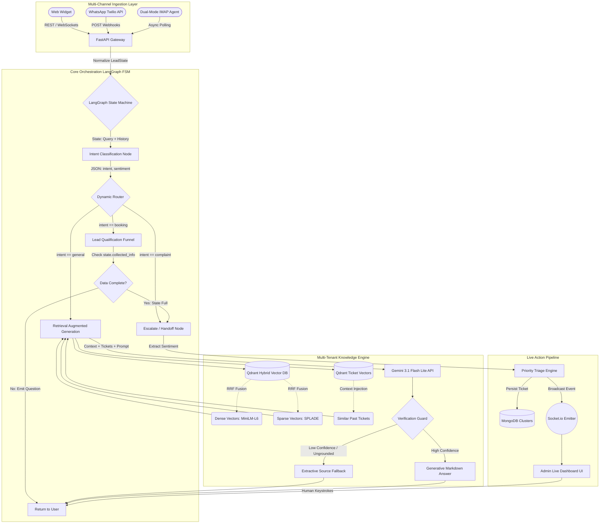

# Closira AI Support Platform

Closira is an **Autonomous Multi-Tenant AI Customer Support Platform** designed for Small and Medium Businesses (SMBs). 

Far beyond a traditional chatbot, Closira operates as a fully autonomous digital employee. It autonomously crawls and digests business websites, manages isolated multi-tenant vector knowledge bases, aggressively qualifies inbound sales leads via deterministic finite state machines, operates natively across **Web, WhatsApp, and Email IMAP**, and instantly triggers real-time live human escalation pipelines when complex intervention is required.

---

## 🧠 Deep System Architecture & Data Flow

The platform is designed around strict separation of concerns, utilizing an Event-Driven API Gateway, a Stateful Orchestration Engine (LangGraph), and a high-performance Vector Retrieval Engine.

### 1. The Multi-Channel Ingestion & Gateway Layer
The perimeter of the system handles asynchronous, heterogeneous inputs across different protocols:
*   **Web Widget (`chatbot-package` & `api/v1/chat.py`)**: A lightweight, embeddable React/TypeScript widget deployed on client sites. It communicates via standard REST for inference, but establishes a persistent **WebSocket (Socket.io)** connection for real-time human-agent handoffs.
*   **Twilio WhatsApp Webhooks (`api/v1/webhooks/whatsapp.py`)**: Subscribes to inbound Twilio POST webhooks. It maps phone numbers to specific tenant company IDs, transforming the WhatsApp payload into the internal graph state schema.
*   **Dual-Mode Email Agent (`services/email_agent.py`)**: A resilient, asynchronous background worker (`asyncio.sleep` polling). It queries Gmail IMAP directly using `X-GM-RAW` filters to intercept specific support tickets (e.g., matching "breakout"). It supports both OAuth 2.0 and strict SMTP App Password authentication, decoupling the system from Google Cloud verification limits.

### 2. The Deterministic Orchestrator (LangGraph FSM)
Every inbound message, regardless of channel, is normalized into a `LeadState` dictionary and pushed into `services/lead_graph.py`. Unlike traditional LLM wrappers, Closira does not allow the model to directly answer the user; it forces the LLM through a strict **Finite State Machine**:

1.  **Intent Classification (`detect_intent`)**: The graph passes the raw query and conversation history to Gemini 3.1 Flash Lite. Using `response_format={"type": "json_object"}`, it deterministically forces the LLM to output one of three strict categories (`booking`, `complaint`, or `general`), along with a sentiment score and emoji.
2.  **Lead Qualification Funnel (`qualify`)**: If the intent is `booking`, the graph routes to the qualification loop. The LLM acts as a strict extraction engine, refusing to answer and instead asking sequential questions until the required structured data (e.g., date, time, group size) is collected in the graph state.
3.  **Dynamic Escalation (`escalate`)**: If the intent is `complaint` or if sentiment drops to `angry`/`frustrated`, the graph bypasses knowledge retrieval entirely. It immediately tags the state with `needs_handoff: True`, halting the AI.
4.  **RAG Node (`rag_answer`)**: Only if the intent is `general` does the state machine allow the query to pass into the Knowledge Engine.

### 3. The Multi-Tenant RAG & Vector Pipeline
When a query reaches `services/rag_engine.py`, it executes a multi-stage retrieval and generation pipeline:
*   **Ingestion & Scraping**: When a tenant provisions a website, the backend spins up a headless Playwright Chromium instance. It maps the full domain (`crawler/map_next_routes.py`), scrapes raw HTML, and passes it to an LLM "Cleaner" (`services/ai_cleaner.py`) to strip noisy DOM elements (navbars, footers) into pure semantic Markdown.
*   **Strict Multi-Tenancy**: Qdrant collections are dynamically provisioned per company and per website (`ticket_knowledge_c{company_id}_w{website_id}`). This mathematically guarantees zero cross-contamination of competitor data.
*   **Hybrid RRF Search**: 
    *   **Dense Embeddings**: Chunks are processed locally via `all-MiniLM-L6-v2` for semantic intent matching.
    *   **Sparse Embeddings (SPLADE)**: Chunks are simultaneously processed via `fastembed` for lexical exact-keyword matching (crucial for SKUs or specific names).
    *   **Reciprocal Rank Fusion (RRF)**: Qdrant fuses both vector spaces to retrieve the mathematically optimal context blocks.
*   **Anti-Hallucination Fallbacks**: Grounded Truths (manual SOPs added by admins) receive massive mathematical rank boosts. If the retrieved context scores too low, or if the LLM's generated response triggers a "low confidence" heuristic, the system safely aborts generative answering and returns a strict Extractive Fallback directly from the source chunk.
*   **Historical Ticket Vectorization**: Past resolved tickets and escalations are continuously embedded into a separate `ticket_queries` Qdrant collection. When the AI processes a query, it dynamically fetches and injects highly-similar past issues (`[SIMILAR PAST TICKETS]`) into its prompt context, allowing it to learn from previous agent resolutions without explicitly treating them as hard-coded SOP facts.

### 4. The Intelligence Backbone (Gemini 3.1 Flash Lite)
The core inference pipeline is powered by Google's **Gemini 3.1 Flash Lite Preview**. By leveraging Gemini's OpenAI-compatible proxy layer (`https://generativelanguage.googleapis.com/v1beta/openai/`), the backend natively utilizes the `openai` Python SDK. This allows the system to execute massive parallel LangGraph JSON extraction tasks at ultra-low latency while maintaining a unified, vendor-agnostic SDK architecture.

### 5. The Real-Time Escalation Pipeline
When the LangGraph FSM emits a `needs_handoff: True` signal:
1.  **Triage**: A structured ticket is generated in MongoDB (`db['tickets']`) with dynamic urgency profiling.
2.  **Socket Emission**: The backend `socket_server.py` emits a payload to the Admin Dashboard.
3.  **Live Takeover**: The dashboard flashes red. The human clicks "Accept", locking the AI Graph out of the session. The human's keystrokes are then piped bi-directionally over the active WebSocket directly into the end-user's Web Widget or WhatsApp thread.

---

## 🏗️ Deep Architecture & Component Diagram



---

## 📂 Deep Repository Directory Structure

```text
closira/
├── backend-fastapi/               # Core Python Intelligence & Orchestration
│   ├── app/
│   │   ├── api/v1/                # REST API Routers
│   │   │   ├── webhooks/          # Twilio WhatsApp Webhook Handlers
│   │   │   ├── chat.py            # Public Widget Chat Endpoints
│   │   │   └── integrations.py    # Gmail OAuth & SMTP Configurations
│   │   ├── services/              # Core Business Logic & AI
│   │   │   ├── lead_graph.py      # LangGraph State Machine Definition
│   │   │   ├── rag_engine.py      # Gemini RAG Pipeline & Prompt Engineering
│   │   │   ├── indexer_service.py # Playwright Scraping & Qdrant Upsertion
│   │   │   ├── ticket_vector_service.py # Historical Ticket Qdrant Injection
│   │   │   └── email_agent.py     # Background IMAP Polling Daemon
│   │   ├── realtime/              # Socket.io Live Handoff Server
│   │   └── core/config.py         # Pydantic Settings & Environment Mgmt
│   └── tests/                     # LangGraph Simulation & E2E Validation
│
├── frontend/                      # Admin & Agent Live Dashboard (React/Vite)
│   ├── src/pages/dashboard/       # Connections, Ticket Inbox, Knowledge Mgmt
│   └── src/services/              # Axios API bindings to FastAPI
│
├── chatbot-package/               # Embeddable Web Widget Library
│   └── src/widget/                # Preact/React isolated chat interface
│
└── prompt_design.md               # Advanced System Prompt architecture definitions
```

---

## 🛠️ Complete Detailed Setup Guide

### 1. Prerequisites & System Dependencies
- **Python 3.10+** (Required for LangGraph and Async API compatibility)
- **Node.js 18+** (Required for Vite and React compilation)
- **MongoDB** (Cloud Atlas or Local instance for Relational Persistence)
- **Qdrant Vector DB** (Must run locally on port `6333` via Docker, or configure a Cloud instance)

### 2. Backend Initialization & Execution
The backend manages all AI inference, state graphs, and live sockets.

```bash
cd backend-fastapi

# 1. Initialize Python Virtual Environment
python3 -m venv .venv
source .venv/bin/activate

# 2. Install Core and AI Dependencies
pip install -r requirements.txt
pip install -r requirements-ai.txt

# 3. Environment Configuration
cp .env.example .env 
```

**Critical `.env` Variables:**
- `GEMINI_API_KEY`: Your Google Gemini API Key (Required for all inference).
- `GEMINI_MODEL`: Must be set to `gemini-3.1-flash-lite-preview`.
- `MONGODB_URI`: Your MongoDB connection string.
- `QDRANT_URL`: Local or Cloud URL to your Qdrant instance.

**Start the API Gateway:**
```bash
# Initializes the FastAPI REST Server and Socket.io Event Loop
python3 run.py
```
*The API and Swagger Docs will instantly boot at `http://localhost:5001/docs`.*

**Start the Async Email Daemon (Optional):**
If you have configured `SMTP_EMAIL` and `SMTP_APP_PASSWORD` in your `.env`, open a secondary terminal pane to start the IMAP polling engine:
```bash
cd backend-fastapi
source .venv/bin/activate
python3 -m app.services.email_agent
```

### 3. Admin Dashboard Frontend Setup
The admin dashboard is where the human agent interacts with the `Socket.io` server to intercept escalating FSM tickets.

```bash
cd frontend
npm install
npm run dev
```
*The dashboard UI will compile and serve at `http://localhost:5173`.*

### 4. Running the Simulation Test Suite
You can simulate the entire AI pipeline (LangGraph routing, Qdrant extraction, Gemini inference) completely headless using the built-in CLI suites:

```bash
cd backend-fastapi

# Test 1: Simulates an angry customer to verify LangGraph routes to the Escalation Node
PYTHONPATH=. python3 app/tests/test_lead_graph.py

# Test 2: Simulates a complex pricing query to verify Qdrant RRF retrieval and JSON schema
PYTHONPATH=. python3 test_api_chat.py
```

---

## ⚠️ Mission Critical Production Notes
1. **Semantic Model Cold Starts**: The `fastembed` library dynamically downloads the `SPLADE` semantic models to disk on the very first run. In a production containerized environment (Kubernetes/Docker), these weights **must** be explicitly baked into your Docker image build step to prevent massive cold-start latency when scaling horizontal pods.
2. **WebSocket Resilience & Pub/Sub**: The current `socket_server.py` implementation handles Live Agent handoffs using an in-memory event loop. To achieve horizontal scaling across multiple FastAPI instances, a **Redis Pub/Sub adapter** must be natively integrated into the Socket.io server configuration to synchronize handoff events across nodes.
3. **Email Rate Limiting**: The IMAP `email_agent.py` processes inbound queues in batches of 5 to rigidly respect Google Workspace limits. If migrating to a high-volume enterprise inbox, adjust this ceiling carefully, and consider offloading polling to a distributed Celery/RabbitMQ task queue.
