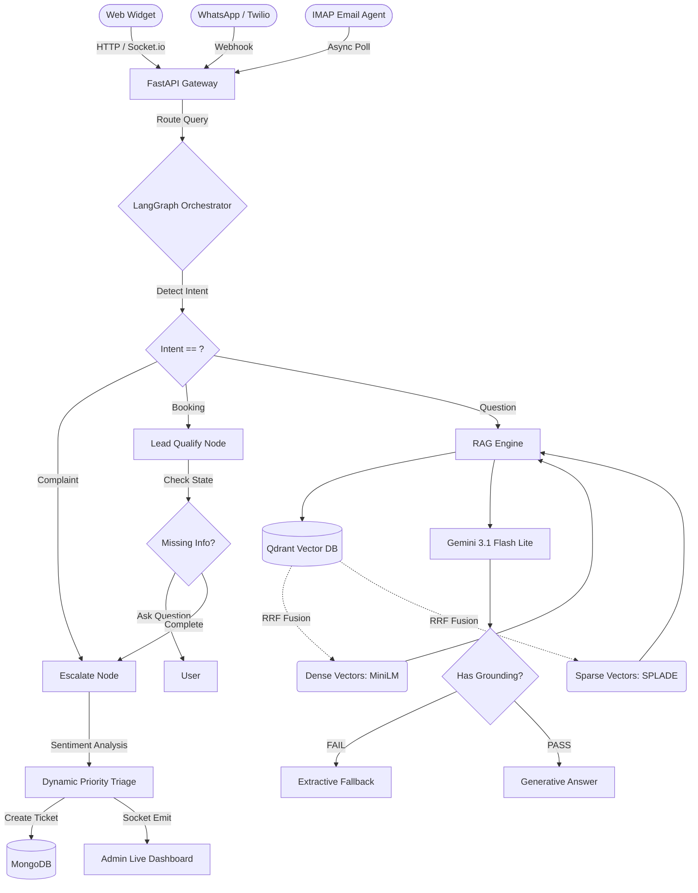

# Closira AI Support Platform

Closira is an **Autonomous AI Customer Support Platform** designed to act as a fully capable, multi-channel support agent for Small and Medium Businesses (SMBs). 

It doesn't just answer questions; it crawls websites, digests knowledge into a multi-tenant vector database, aggressively qualifies sales leads using a deterministic state machine, operates across **Web, WhatsApp, and Email**, and instantly escalates to a live human agent if a customer is angry or requires a complex intervention.

---

## 🧠 System Architecture & Data Flow

### 1. Multi-Channel Ingestion
The platform interacts with customers across three primary channels:
*   **Web Widget (`chatbot-package`)**: An embeddable React/TS widget that sits on a customer's website, communicating via REST and maintaining persistent `Socket.io` connections for human handoffs.
*   **WhatsApp (`app/api/v1/webhooks/whatsapp.py`)**: Integrates with the Twilio API to handle two-way conversational messaging on WhatsApp.
*   **Dual-Mode Email Agent (`app/services/email_agent.py`)**: An asynchronous background worker that polls IMAP inboxes (supporting both OAuth and legacy App Passwords). It actively filters and processes "breakout" support tickets automatically.

### 2. The Orchestrator (LangGraph State Machine)
All messages (regardless of channel) funnel into `lead_graph.py`, a rigorous **Finite State Machine** built with LangGraph:
1.  **Intent Detection Node**: Checks if the user is asking a general question, trying to book a service, or filing an angry complaint. It uses strict JSON-mode LLM extraction.
2.  **Lead Qualification Node**: If the user wants to book/purchase, the State Machine traps them in a qualification funnel, asking targeted questions to gather required structured data before handing them off.
3.  **RAG Node**: If they have a general question, it routes to the Knowledge Engine.

### 3. The RAG Engine & Multi-Tenant Knowledge Base
The system uses a **Hybrid Vector Search** via Qdrant to power the LLM (`rag_engine.py`):
*   **Knowledge Ingestion**: Playwright crawls the admin-submitted URLs, an LLM strips the raw HTML into clean Markdown, and `indexer_service.py` chunks it.
*   **Multi-Tenant Architecture**: Every company and website has strictly isolated collections (e.g., `ticket_knowledge_c5_w1`) to prevent cross-contamination of knowledge.
*   **Dense Embeddings**: Uses a local `all-MiniLM-L6-v2` model for semantic understanding.
*   **Sparse Embeddings (SPLADE)**: Uses `fastembed` for exact keyword matching (crucial for product numbers or specific nouns).
*   **Anti-Hallucination Framework**: Uses **Reciprocal Rank Fusion (RRF)**. Additionally, "Grounded Truths" (facts manually added by an admin) are given massive rank boosts. The prompt strictly forces the LLM to provide exact sitemap URLs rather than inventing links, and relies on extractive fallbacks if the model goes off-script.

### 4. The Intelligence Layer (Gemini 3.1 Flash Lite Preview)
The entire intelligence backbone runs on Google's **Gemini 3.1 Flash Lite Preview**. 
By utilizing Gemini's OpenAI-compatible API endpoint (`https://generativelanguage.googleapis.com/v1beta/openai/`), the platform natively utilizes the `openai` SDK to handle complex LangGraph JSON routing and dense Markdown generation without sacrificing speed.

### 5. The Escalation Engine (Socket.io)
If a user asks something out of scope, or if the `infer_sentiment` utility detects they are **Angry/Frustrated**, the `escalate` node fires:
1.  **Ticket Generation**: A structured JSON payload is created with dynamic urgency (e.g., `CRITICAL`).
2.  **Real-Time Handoff**: The backend emits a `Socket.io` event to the Agent Dashboard (`frontend`).
3.  **Live Takeover**: The human agent's screen flashes. They click "Accept", locking the AI out, and taking over the conversation seamlessly in real-time.

---

## 🏗️ Architecture Diagram



---

## 📂 Repository Structure

```text
closira/
├── backend-fastapi/        # The Intelligence & API Gateway
│   ├── app/api/            # REST API Routes and Webhooks (Twilio/Gmail)
│   ├── app/services/       # RAG, Crawlers, Email Polling, Graph State Machine
│   ├── app/realtime/       # Socket.io server for Live Chat handoff
│   └── tests/              # End-to-end simulation and validation tests
├── frontend/               # The Admin & Live Agent Dashboard (React, Vite, Tailwind)
├── chatbot-package/        # The Embeddable Web Widget UI code
└── test_transcripts/       # Simulated conversations testing LangGraph routing
```

---

## 🛠️ Complete Setup & Execution Guide

### 1. Prerequisites
- **Python 3.10+** (For the FastAPI backend and AI pipelines)
- **Node.js 18+** (For the React Dashboards)
- **MongoDB** (Cloud Atlas or Local instance)
- **Qdrant Vector DB** (Must run locally on port `6333` via Docker, or configure a Cloud instance)

### 2. Backend Initialization
The backend relies on the `uv` package manager/runner, but standard `pip` can also be used.

```bash
cd backend-fastapi

# 1. Setup Virtual Environment
python3 -m venv .venv
source .venv/bin/activate

# 2. Install Dependencies
pip install -r requirements.txt
pip install -r requirements-ai.txt

# 3. Environment Configuration
cp .env.example .env 
```

**Inside your `.env` file, configure:**
- `GEMINI_API_KEY`: Your Google Gemini API Key.
- `MONGODB_URI`: Your MongoDB connection string.
- `QDRANT_URL`: URL to your Vector DB (e.g., `http://localhost:6333`).

**Run the Server:**
```bash
# Starts the FastAPI REST Server and Socket.io instances
python3 run.py
```
*The backend API and Swagger Docs will be available at `http://localhost:5001/docs`.*

**Run Background Workers (Optional):**
If you have configured `SMTP_EMAIL` and `SMTP_APP_PASSWORD` in your `.env`, you can spin up the background email polling agent:
```bash
python3 -m app.services.email_agent
```

### 3. Dashboard Frontend Setup
The admin dashboard allows you to manage knowledge bases, view leads, and interact with the Live Socket.

```bash
cd frontend
npm install
npm run dev
```
*The dashboard will be available at `http://localhost:5173`.*

### 4. Testing the System
You can simulate full AI pipeline queries without running the frontend by executing the built-in CLI tests:

```bash
cd backend-fastapi
# Tests the LangGraph Lead Qualification and Complaint Escalation routing
PYTHONPATH=. python3 app/tests/test_lead_graph.py

# Tests the RAG retrieval pipeline and JSON responses
PYTHONPATH=. python3 test_api_chat.py
```

---

## ⚠️ Notes for Production Deployment
1. **Model Cold Starts**: `fastembed` automatically downloads the SPLADE semantic models on first run. In a production container environment, these weights should be explicitly baked into your Docker image to prevent massive cold-start latency.
2. **WebSocket Resilience**: The current `socket_server.py` handles Live Agent handoffs in-memory. For horizontal scaling across multiple instances, a Redis Pub/Sub adapter must be integrated into the Socket.io server configuration.
3. **Email Rate Limiting**: The IMAP `email_agent.py` processes messages in batches of 5 to respect strict Google Workspace and personal Gmail rate limits. Adjust this ceiling carefully if migrating to high-volume enterprise ingestion.
