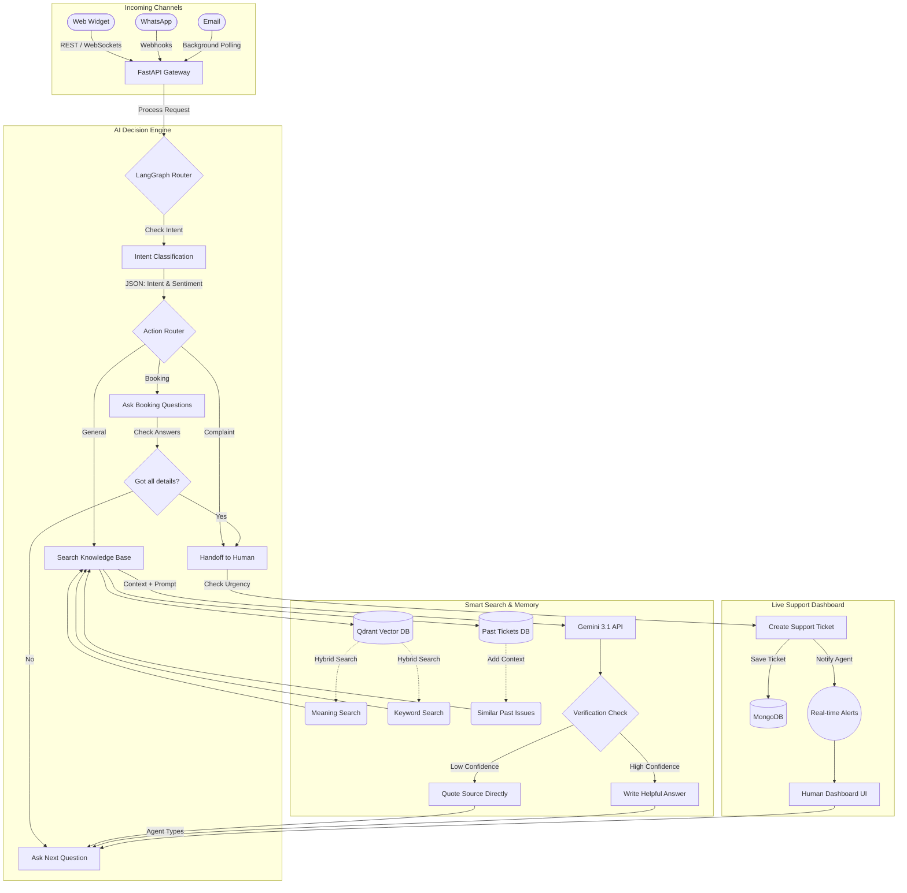

# Closira AI Support Platform

Closira is an **AI Customer Support Platform** designed for Small and Medium Businesses (SMBs). 

It acts as a digital support agent that can read a business's website, understand customer questions, and reply accurately. It handles chats on **Web, WhatsApp, and Email**. When it encounters a complex issue or an angry customer, it automatically passes the conversation to a real human agent.

---

## 🧠 System Architecture



---

## 🎯 How It Meets the Assignment Requirements

I used **LangGraph** to build a structured AI flow (`backend-fastapi/app/services/lead_graph.py`). This ensures the AI always follows the correct steps and doesn't get confused.

### 1. FAQ Answering
*   Instead of just giving the AI a massive text file, I built a **Hybrid RAG system** using Qdrant.
*   **Safety First**: If a customer asks a question that isn't in the knowledge base, the system recognizes that it doesn't know the answer and politely offers to connect them to a human, preventing the AI from making things up.
*   **Learning from Past Tickets**: The system saves resolved support tickets in a vector database. When a new question comes in, the AI pulls up similar past tickets to give a better answer based on real history.

### 2. Lead Qualification
*   When a customer wants to book a service, the AI enters a "qualification mode". It will stop answering general questions and instead ask the customer 2-3 specific questions (like group size and date) one at a time until it gets all the details.

### 3. Escalation Detection
*   The AI automatically hands off the chat to a human if:
    1. The customer is making a complaint.
    2. The customer seems angry or frustrated.
    3. The AI isn't confident in its answer.
*   It does this by sending a real-time alert (via `Socket.io`) to an Admin Dashboard where a human can take over immediately.

### 4. Conversation Summary
*   At the end of a chat, the AI automatically creates a clean, structured summary of what the customer wanted, the details they provided, and what the human agent should do next.

---

## 📂 Deliverables & Repository Structure

*   📄 `prompt_design.md`: Explains how I wrote the AI prompts and handled safety.
*   📁 `test_transcripts/`: Contains 5 example chats showing exactly how the AI behaves in different scenarios (like handling complaints or out-of-scope questions).
*   💻 **The Code**: The main logic is located in `backend-fastapi/app/services/`.

---

## 🛠️ Setup & Running the Project

## 🛠️ Setup & Running the Project

This project includes a full React frontend, a FastAPI backend, and multiple database dependencies (MongoDB and Qdrant). Thanks to Docker Compose, you can launch the entire ecosystem with a single command.

### 1. Prerequisites
- **Docker & Docker Compose** installed on your machine.
- An active **Google Gemini API Key**.

### 2. Configuration
Clone the repository and set up your environment variables:
```bash
cp backend-fastapi/.env.example backend-fastapi/.env
```
Open `backend-fastapi/.env` and add your Gemini API Key:
```env
GEMINI_API_KEY=your_actual_google_gemini_key_here
GEMINI_MODEL=gemini-3.1-flash-lite-preview
```
*(Note: You do not need to configure the MongoDB or Qdrant URLs; Docker Compose automatically links the internal container networking!)*

### 3. One-Click Boot
From the root of the repository, simply run:
```bash
docker compose up --build -d
```

This will automatically:
1. Pull and boot **MongoDB** and **Qdrant** with persistent volumes.
2. Build and boot the **FastAPI AI Backend** at `http://localhost:5001`.
3. Build and boot the **React Admin Dashboard** at `http://localhost:5173`.

### 4. Background Workers (Optional)
If you want to test the autonomous email polling feature (where the AI reads and replies to incoming support emails), add your Google Workspace `SMTP_EMAIL` and `SMTP_APP_PASSWORD` to the `.env` file, and then run the daemon in a separate terminal:
```bash
cd backend-fastapi
python3 -m venv .venv
source .venv/bin/activate
pip install -r requirements.txt
python3 -m app.services.email_agent
```

---

## 🚀 Testing the Assignment Requirements
If you just want to quickly test the core AI logic (FAQ, Lead Qual, Escalation) for the assignment without setting up Docker or MongoDB, I built a headless CLI demo:

```bash
cd backend-fastapi
source .venv/bin/activate
# Run the interactive terminal chatbot
PYTHONPATH=. python3 cli_demo.py
```

---

## ⚖️ Trade-offs & Known Limitations

1. **Speed vs. Safety**: Because the AI double-checks the intent before generating an answer, it takes about a second longer to reply. This trade-off is worth it because it guarantees the AI stays safe and follows the rules.
2. **Sensitive Escalation**: The sentiment detector is very strict. If a user playfully uses a bad word, it might escalate to a human. In a business setting, it is better to accidentally escalate a safe chat than to ignore an angry customer.
3. **Demo Simplification**: While the full app uses Qdrant for memory, the `cli_demo.py` script bypasses the database connection so you can run it easily on your laptop without installing Docker. 

Thank you for reviewing my submission! Let me know if you have any questions!
