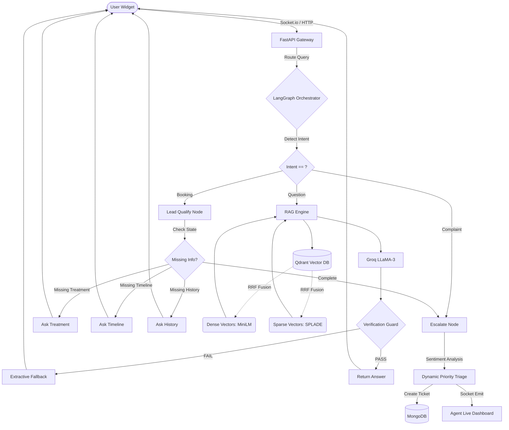

# Closira AI Support Platform

Closira is an **Autonomous AI Customer Support Platform** designed for Small and Medium Businesses (SMBs). It doesn't just answer questions; it crawls your website to learn about your business, answers user questions using highly advanced vector search, aggressively qualifies sales leads using a deterministic state machine, and instantly escalates to a live human agent via WebSockets if the customer is angry or asks something the AI doesn't know.

## 🧠 How the Architecture Works (Top to Bottom)

### 1. The Frontend (React + Vite + TailwindCSS)
The frontend serves two distinct purposes:
*   **The Live Customer Widget**: A sleek, embeddable chat widget that sits on a customer's website. It communicates with the backend via REST API for AI answers and upgrades to a persistent `Socket.io` connection if the user needs to talk to a human.
*   **The Admin & Agent Dashboard**: A secure portal where business owners can:
    *   Add website URLs to be crawled.
    *   Manually enter "Trusted Grounded Facts" (SOPs).
    *   Monitor the **Live Agent Inbox**, where escalating tickets appear in real-time. Human agents can click on a ticket, take over the WebSocket, and chat directly with the customer.

### 2. The Data Ingestion Engine (How the AI Learns)
Before the AI can answer questions, it has to learn.
*   **Playwright Crawler**: When an admin enters a URL, the backend spins up a headless Chromium browser using Playwright. It maps the website, discovers links, and scrapes the raw HTML.
*   **AI Content Cleaner**: The raw HTML is filled with junk (navbars, footers, scripts). The backend passes the HTML to a fast LLM (`Claude 3 Haiku` or `Groq LLaMA-3`) which acts as an "AI Cleaner", stripping out the junk and returning pure, readable Markdown.
*   **Vectorization**: The clean text is passed to `indexer_service.py`. It is split into chunks of 1000 characters.

### 3. The Database Layer & Hybrid Search
This is where Closira separates itself from basic chatbots. It uses a **Hybrid Vector Search**:
*   **Dense Embeddings**: It uses a local AI model (`all-MiniLM-L6-v2`) to convert text chunks into 384-dimensional dense vectors. This understands *semantic meaning* (e.g., knowing "pricing" and "cost" are similar).
*   **Sparse Embeddings (SPLADE)**: It uses `fastembed` to generate sparse vectors. This understands *exact keyword matches* (crucial for finding specific product serial numbers or proper nouns).
*   **Qdrant Vector DB**: Both the Dense and Sparse vectors are stored in Qdrant. When a user asks a question, Qdrant uses **Reciprocal Rank Fusion (RRF)** to search both vector spaces simultaneously and combine the rankings, ensuring the AI finds the exact right paragraph of context.
*   **MongoDB**: Stores the relational data (User Accounts, Chat Transcripts, Tickets, and Sitemaps).

### 4. The Orchestrator (LangGraph State Machine)
When a customer sends a message from the widget, it hits `/api/v1/rag/chat`. Instead of just asking the LLM to reply, it enters `lead_graph.py`, a rigorous **Finite State Machine** built with LangGraph:
1.  **Intent Detection Node**: First, it checks if the user is asking a question, trying to book a service, or filing an angry complaint.
2.  **Lead Qualification Node**: If they want to book a service, the State Machine traps them in a funnel. It refuses to answer until it asks: *1. What treatment do you want? 2. When do you want it? 3. Is this your first time?*
3.  **RAG Node**: If they just have a general question, it routes to the RAG Engine.

### 5. The RAG Engine & Anti-Hallucination System
If the user asks a question, the `rag_engine.py` takes over. It has extreme protections against hallucinating (making things up):
*   **Supreme Grounded Facts**: If an admin manually typed a fact into the dashboard (like "Botox is £200"), that vector gets a massive mathematical rank boost (`+5.0`). This guarantees the AI reads the manual truth *before* it reads any crawled website data.
*   **The Verification Guard**: The primary LLM generates an answer. *Before* showing it to the user, a secondary "Validator LLM" reads the answer and double-checks it against the database. If it detects *any* ungrounded claims, it deletes the answer and safely falls back to: *"I don't have specific information about that."*

### 6. The Escalation Engine (Socket.io)
If the user asks something out of scope, or if the `infer_sentiment` utility detects they are **Angry** or **Frustrated**, the `escalate` node is triggered.
1.  **Ticket Generation**: A structured JSON payload is created. Because the sentiment was "angry", the urgency is dynamically set to `CRITICAL`.
2.  **Database Storage**: A new Ticket is saved in MongoDB.
3.  **Real-Time Handoff**: The backend emits a `Socket.io` event to the Agent Dashboard.
4.  **Live Takeover**: A human agent sees the screen flash red with a critical ticket. They click "Accept". The AI is immediately locked out of the chat, and the human's keystrokes are piped directly through the WebSocket to the customer's browser widget.

---

## 🏗️ System Architecture



---

## 📂 Repository Structure

```
closira/
├── backend-fastapi/        # The Intelligence Layer
│   ├── app/services/       # RAG, Crawlers, Ticket Services
│   │   ├── lead_graph.py   # LangGraph Lead Qualification FSM
│   │   ├── rag_engine.py   # Core Retrieval Augmented Generation
│   │   └── indexer_service.py # SPLADE + Dense Embedding Upsertion
│   ├── app/realtime/       # Socket.io server for Live Chat handoff
│   └── tests/              # End-to-end Socket & LangGraph tests
├── frontend/               # The Admin & Agent Dashboard (React, Vite, Tailwind)
├── prompt_design.md        # Detailed breakdown of prompt engineering & AI safety
└── test_transcripts/       # Simulated conversations of expected behaviors
```

## 🛠️ How to Run

### 1. Prerequisites
- Python 3.10+
- Node.js 18+
- MongoDB instance (URL in `.env`)
- Qdrant Vector DB (Runs locally on port `6333` via Docker or Cloud)

### 2. Backend Setup
```bash
cd backend-fastapi
python3 -m venv .venv
source .venv/bin/activate
pip install -r requirements.txt
cp .env.example .env # Add your API keys (GROQ, MongoDB, Qdrant)
python3 run.py
```
*The backend runs on `http://localhost:5001`*

### 3. Frontend Setup
```bash
cd frontend
npm install
npm run dev
```
*The frontend runs on `http://localhost:5173`*

### 4. Running Automated Tests
```bash
cd backend-fastapi
PYTHONPATH=. .venv/bin/python3 app/tests/test_lead_graph.py
```

---

## ⚠️ Notes for Production Deployment
1. **Model Cold Starts**: `fastembed` downloads the SPLADE models on first run. In production, these weights should be baked into the Docker image to prevent cold-start latency.
2. **WebSocket Resilience**: The current `socket_server.py` runs in-memory. For multi-instance horizontal scaling, a Redis Pub/Sub adapter must be configured.
